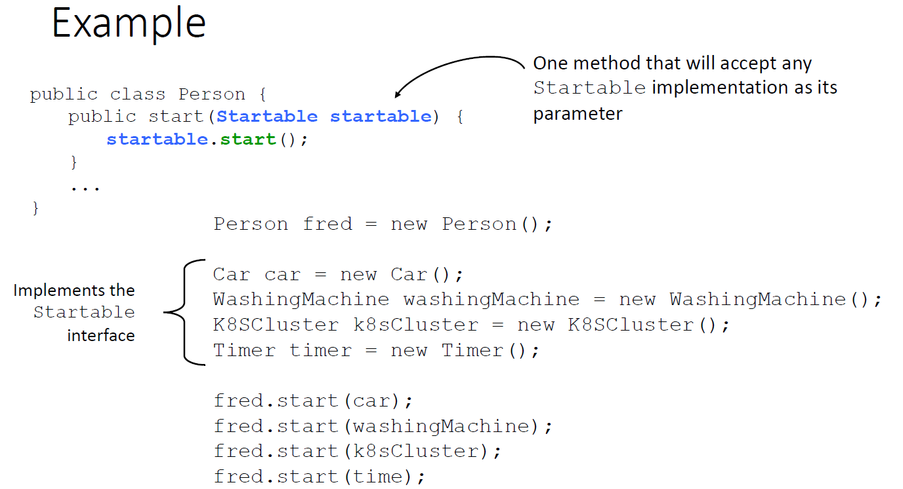

## Recap 2

Focus more on object oriented programming by:
- introducing classes: attributes(properties), behaviors and events
- properties of OOP: Encapsulation, Inheritance, Polymorphism, Abstraction
- Overloading and overriding

Access control level to a class, method or fields

### Interface

Implements Startable means that the class will provide implementations for all the methods declared in the Startable interface. This is a way of ensuring that the class adheres to a specific behavior, as defined by the Startable interface.
```java
public interface Startable {
  public void start();
  public void stop();
  // See Person, Car and WashingMachine classes for examples of how to use this interface
}
```
For example, if the Startable interface has a method signature void start(), the class implementing Startable must provide an implementation for this method:
```java
public class WashingMachine implements Startable {
    @Override
    public void start() {
        // Implementation of the start method
    }
}
```


## Folder Structure

The workspace contains two folders by default, where:

- `src`: the folder to maintain sources
- `lib`: the folder to maintain dependencies

Meanwhile, the compiled output files will be generated in the `bin` folder by default.

> If you want to customize the folder structure, open `.vscode/settings.json` and update the related settings there.

## Dependency Management

The `JAVA PROJECTS` view allows you to manage your dependencies. More details can be found [here](https://github.com/microsoft/vscode-java-dependency#manage-dependencies).
